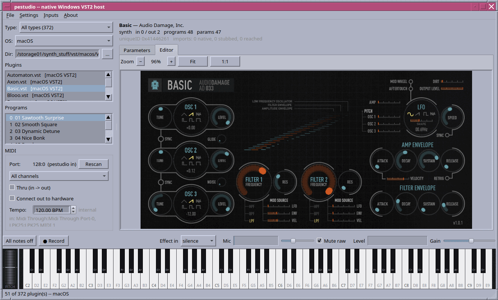
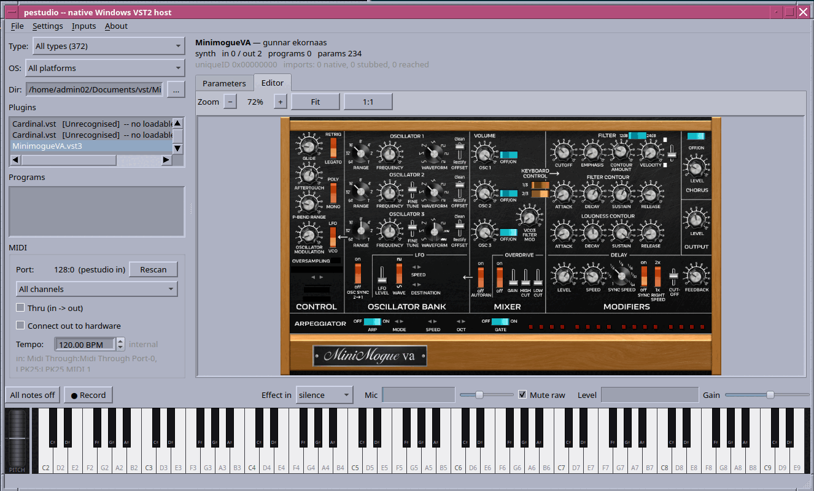
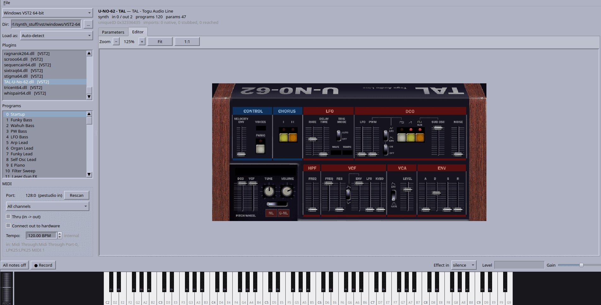

# Running plug-ins natively, without Wine

Audio plug-ins built for Windows, macOS and Mac OS 9, loaded and run as native
code on Linux. Not emulation and not Wine: a PE loader with a Win32 subsystem
underneath it, a Mach-O loader with an Objective-C runtime and a software Metal
rasteriser, and a CFM/PEF interpreter for Classic — six hosts sharing one set of
shims. **pestudio** (Qt6) and **dwstudio** (GTK4) are the same host in two
toolkits: pick a plug-in, get its programs, parameters, a playable keyboard,
patch banks, a recorder, and the plug-in's own editor.

| target | plug-ins | status |
|---|---|---|
| Windows VST2, x86-64 | 40 | 39 load, 36 render, 39 draw their editor |
| Windows VST2, i386 | 40 | 36 load, 34 render, 36 draw their editor |
| Windows VST3, x86-64 | 35 | 35 load, 33 render, 35 draw their editor |
| Linux VST2 (`.so`), x86-64 | 39 | 37 render |
| Linux VST3, x86-64 | 13 | 7 render, X11-embedded editors |
| macOS VST2 / VST3 / AU | 99 | 90 render, editors open and are driven |

## What it looks like

*Basic (Audio Damage), a **macOS** VST2 playing on Linux — 372 plug-ins in the
browser behind it.*

*MinimogueVA, a Windows VST2 with 234 parameters, its editor drawn by the Win32
layer and blitted.*

*FB-7999, a Korg DW-8000 simulation and the plug-in this started on.*

*FB-3300, four synthesiser blocks and 229 parameters, all of it drawn by the
same layer.*

*TAL U-NO-62, a Juno-60 simulation, with its 120 factory programs listed.*

*Cardinal — VCV Rack as a Linux VST3, an OpenGL editor embedded as an X11 child
at 59 fps.*

## Installing

Packages are on the
[releases page](https://github.com/spacestate1/VST-ace/releases):

    sudo apt install ./vst-ace_0.3.0-1_amd64.deb         # Debian 13+, Ubuntu 24.04+
    sudo dnf install ./vst-ace-0.3.0-1.fc43.x86_64.rpm   # Fedora 40+
    sudo pacman -U ./vst-ace-0.3.0-1-x86_64.pkg.tar.zst  # Arch

`apt install ./`, not `dpkg -i` — apt is what pulls in GTK 4, Qt 6 and the rest,
and the `./` is what makes it read a path rather than a package name. `dnf
install ./` for the same reason; `pacman -U` takes a file either way. That puts
`va`, `pestudio` and `dwstudio` on `$PATH` and both windows in the desktop menu.

There is also an AppImage, which installs nothing and needs no root:

    chmod +x vst-ace-0.3.0-x86_64.AppImage
    ./vst-ace-0.3.0-x86_64.AppImage

The `.deb` and the Arch package carry `peload32`, the i386 helper that hosts
32-bit Windows VST2 plug-ins; the `.rpm` does not, since Fedora's 32-bit
development libraries are not there to build it against. Turning it on, where
the Microsoft runtime DLLs a few plug-ins need go, and where the browsers look
for plug-ins are in [`docs/INSTALL.md`](docs/INSTALL.md).

Editors embed through an X11 window id, so both windows ask for the X11 backend
under Wayland; XWayland is enough.

## Running

    dw                       open a window — whichever matches the desktop
    va pe <dir|bank.json>    the Qt window, on a folder or a patch bank
    va peload <plug-in>      the same hosts from the command line:
                             --params, --render out.wav, --editor shot.ppm
                             --save-state/--load-state for a plug-in whose
                             settings its parameters do not describe

A plug-in that faults is hosted in a helper process by default, so it costs a
line of text rather than the session. `PEHOST_ISOLATE=0` runs everything
in-process the way it used to; three plug-ins in the corpus only work in the
helper.

## In a DAW

The hosts above are programs you run. The same loaders are also a Linux VST2
that a DAW loads on a track, which is the only way Ardour, Reaper, Bitwig,
Qtractor and Carla will ever open a `.dll`:

    cp peload/build/libvst-ace-bridge.so  ~/.vst/FB-3300.so
    cp /path/to/FB-3300.dll               ~/.vst/

Name it after the plug-in and put the real thing beside it — the copy works
out which plug-in it stands for from its own file name. A `.vstace` file
holding a path does instead, for a plug-in that has to live somewhere else,
and `VSTACE_TARGET` overrides both.

Audio, MIDI with sample-accurate timing, parameters, programs, the DAW's
tempo and transport, opaque plug-in state and the editor all go through. A
bridged plug-in renders bit-identical audio to the same plug-in loaded
directly. One that will not load keeps the track and passes silence, with the
reason on stderr, rather than failing the load and losing your place.

## Building

    bash packaging/install-deps.sh     # apt, dnf, yum, pacman or zypper
    ./va build                         # everything, both windows included
    python3 tools/regress.py           # everything checkable without plug-ins

`packaging/build-deb.sh`, `build-rpm.sh`, `build-arch.sh` and
`build-appimage.sh` each take a version and put a package in `release/`. Build
each on the distribution it is for — a package built against one release's Qt
and GTK will not run on another's — and build the AppImage on the oldest
distribution you mean to support, since the host's glibc is the one thing it
cannot carry.

`peload/README.md` has the long version, including what the remaining failures
are; `PLUGINS.md` lists all 270 plug-ins the hosts are tested against.

MIT — see `LICENSE`. No plug-in binaries are included.
