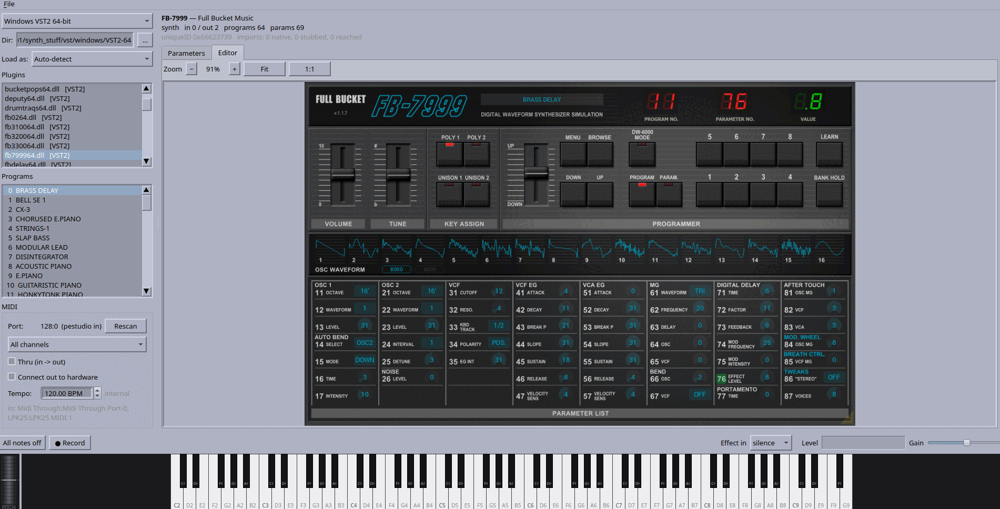

# Running plug-ins natively, without Wine

Audio plug-ins built for Windows, macOS and Mac OS 9, loaded and run as native
code on Linux. Not emulation and not Wine: a PE loader with a Win32 subsystem
underneath it, a Mach-O loader with an Objective-C runtime and a software Metal
rasteriser, and a CFM/PEF interpreter for Classic — six hosts sharing one set of
shims. **pestudio** (Qt6) and **dwstudio** (GTK4) are the same host in two
toolkits: pick a plug-in, get its programs, parameters, a playable keyboard,
patch banks, a recorder, and the plug-in's own editor.

| target | plug-ins | status |
|---|---|---|
| Windows VST2, x86-64 | 40 | 39 load, 36 render, 39 draw their editor |
| Windows VST2, i386 | 40 | 36 load, 34 render, 36 draw their editor |
| Windows VST3, x86-64 | 35 | 35 load, 33 render, 35 draw their editor |
| Linux VST2 (`.so`), x86-64 | 39 | 37 render |
| Linux VST3, x86-64 | 13 | 7 render, X11-embedded editors |
| macOS VST2 / VST3 / AU | 99 | 90 render, editors open and are driven |

*FB-7999, a Windows VST2 running as native code, its editor drawn by the Win32
layer and blitted.*

## Installing

Packages are on the
[releases page](https://github.com/spacestate1/VST-ace/releases):

    sudo apt install ./vst-ace_0.2.0-1_amd64.deb        # Debian 13+, Ubuntu 24.04+
    sudo dnf install ./vst-ace-0.2.0-1.fc43.x86_64.rpm  # Fedora 40+

`apt install ./`, not `dpkg -i` — apt is what pulls in GTK 4, Qt 6 and the rest.
That puts `va`, `pestudio` and `dwstudio` on `$PATH` and both windows in the
desktop menu. 32-bit Windows plug-ins, the Microsoft runtime DLLs a few plug-ins
need, and where the browsers look for plug-ins are in
[`docs/INSTALL.md`](docs/INSTALL.md).

Editors embed through an X11 window id, so both windows ask for the X11 backend
under Wayland; XWayland is enough.

## Running

    dw                       open a window — whichever matches the desktop
    va pe <dir|bank.json>    the Qt window, on a folder or a patch bank
    va peload <plug-in>      the same hosts from the command line:
                             --params, --render out.wav, --editor shot.ppm

## Building

    bash packaging/install-deps.sh     # apt, dnf, yum, pacman or zypper
    ./va build                         # everything, both windows included
    python3 tools/regress.py           # everything checkable without plug-ins

`peload/README.md` has the long version, including what the remaining failures
are; `PLUGINS.md` lists all 270 plug-ins the hosts are tested against.

MIT — see `LICENSE`. No plug-in binaries are included.
