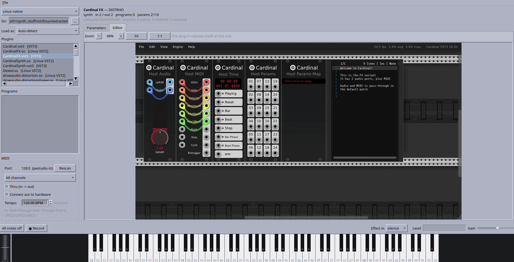
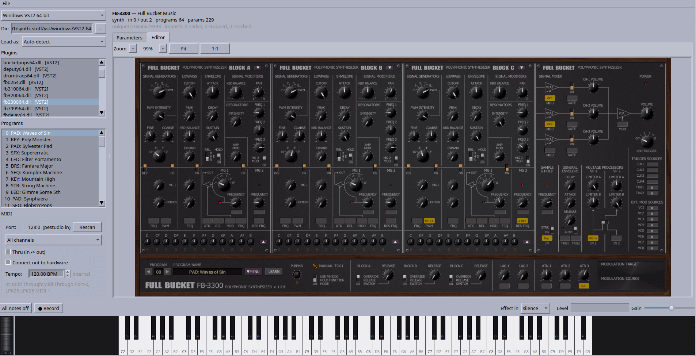

# Running plug-ins natively, without Wine

Audio plug-ins built for Windows, macOS and Linux, loaded and run as native code
on Linux. Not emulation and not Wine: a PE loader with a Win32 subsystem
underneath it, a Mach-O loader with an Objective-C runtime and a software Metal
rasteriser, and a CFM/PEF interpreter for Classic Mac OS — six hosts sharing one
set of shims.

| target | plug-ins | status |
|---|---|---|
| Windows VST2, x86-64 | 36 | 34 render, 35 open their own GUI |
| Windows VST2, i386 | 36 | 34 render, 35 open their own GUI, live playback |
| Windows VST2, i386, bridged | 36 | 34 render, 34 GUIs, out-of-process |
| Windows VST3, x86-64 | 35 | 35 render, 34 open their own GUI |
| Linux VST2 (`.so`), x86-64 | 39 | 37 render |
| Linux VST3, x86-64 | 13 | 7 render, X11-embedded editors |
| macOS VST2, x86-64 | 31 | 31 render, 30 open and drive their own GUI |
| macOS VST3, x86-64 | 18 | 18 render, 18 open and drive their own GUI |
| macOS Audio Units, x86-64 | 50 | 41 render, every one with a Cocoa view opens and drives it |

`peload/README.md` has the long version, including what the remaining failures
are and why most of them turned out to be host bugs wearing a plug-in's clothes.
`PLUGINS.md` lists all 270 plug-ins the hosts are tested against.

*FB-7999 — a Korg DW-8000 simulation, and the plug-in this whole effort started
on. A Windows VST2 running as native code on Linux: the Win32 layer draws its
editor into a buffer, the host blits it, and the zoom bar has scaled it to 91% to
fit the pane. The preset names on the left were read out of the `.dll`.*

*Cardinal — VCV Rack as a Linux VST3. Its editor is not a picture the host draws
but an OpenGL window the plug-in paints itself, embedded as an X11 child and
running at 59 fps inside the host. Nothing on this side can scale that, so the
zoom asks the plug-in to lay itself out again instead — which is what the note
beside the bar is saying.*

*FB-3300 — a Korg PS-3300 simulation. Three complete synthesizer blocks and 229
parameters, the widest editor in the corpus.*

## What is in here

    peload/     the loaders and the shims, plus pestudio (Qt6)
    gui/        dwstudio (GTK4)
    c/          the reimplemented engines and the command-line tools
    patches/    patch banks the hosts and the engines share
    scripts/    the analysis that produced them — Ghidra, Z80, wavetables
    tools/      resource and symbol dumps, arity tables, the checks
    packaging/  the Debian and Fedora packages, and the dependency installer

### Two windows

**pestudio** (`peload/qtgui`, Qt6) is a plug-in browser and player: pick a
format and a platform, pick a plug-in, and get its programs, every exposed
parameter, a playable keyboard, a pitch wheel, patch banks, a recorder, and the
plug-in's own editor — blitted for Windows plug-ins, embedded as an X11 child
window for native Linux ones.

**dwstudio** (`gui/`, GTK4) is the same host beside the engines in `c/src`: a
DW-8000, a 4-op FM synth, a Juno-6 and sample kits, voiced from banks read
straight out of the plug-in binaries rather than extracted to disk first. Both
halves share one audio graph, one keyboard and one MIDI input.

Both host through the same `pehost` API and differ only in toolkit, which is
deliberate: it is what makes a plug-in that misbehaves in one and not the other
worth investigating.

### The engines

`c/` is a from-scratch implementation of the synths, not a wrapper: `dwrender`
renders a preset bank to WAV with no plug-in loaded at all, and `dwplay` plays
one live. `c/README.md` covers them.

## Installing

Packages are on the
[releases page](https://github.com/spacestate1/VST-ace/releases) — a `.deb` for
Ubuntu 24.04 and Debian 13 or newer, and an `.rpm` for Fedora 40 or newer:

    sudo apt install ./vst-ace_0.2.0-1_amd64.deb        # Debian, Ubuntu
    sudo dnf install ./vst-ace-0.2.0-1.fc43.x86_64.rpm  # Fedora

`apt install`, not `dpkg -i`. The leading `./` is what makes apt read the
argument as a file rather than a package name, and apt is what pulls in GTK 4,
Qt 6, PipeWire and the rest -- fourteen dependencies, all stock. `dpkg -i`
unpacks the one file and stops, leaving the package unconfigured and printing
the libraries it could not find; `sudo apt install -f` finishes that off.

That puts `va`, `pestudio` and `dwstudio` on `$PATH`, the patch banks in
`/usr/share/vst-ace/patches`, and both windows in the desktop menu.

Either package hosts 64-bit plug-ins. **32-bit Windows VST2** plug-ins are
loaded by `peload32`, the i386 helper the 64-bit hosts bridge to out of
process; the `.deb` carries it. Its runtime libraries are `Suggests` rather
than `Depends`, so the package installs on a machine that has never enabled a
foreign architecture and `peload32` says what is missing rather than failing
obscurely. To turn it on:

    sudo dpkg --add-architecture i386 && sudo apt update
    sudo apt install libx11-6:i386 libfreetype6:i386 \
                     libasound2t64:i386 libpipewire-0.3-0t64:i386

There is no equivalent in the `.rpm` yet; on Fedora, 32-bit plug-ins still want
a build from source.

A few plug-ins import a Microsoft C or C++ runtime that cannot be stubbed --
iostreams and locale objects carry vtables and internal state -- and they load
only with the genuine DLL present. It is not ours to redistribute, so the main
package ships the place to put it -- both widths, empty, with a README beside
them:

    /usr/lib/vst-ace/runtime/      x86-64 DLLs, for the 64-bit hosts
    /usr/lib/vst-ace/runtime32/    i386 DLLs, for peload32

Drop `msvcp120.dll` from the Visual C++ 2013 redistributable into the first,
and `msvcp120.dll` with `msvcr120.dll` beside it into the second. Both are
searched next to the installed binaries, so there is nothing to configure;
`PELOAD_DLL_PATH` overrides the search if they live somewhere else. Everything
apart from those plug-ins works with both directories empty, which is how they
ship. Wine's builds of the same DLLs are refused rather than loaded: they are
compiled against Wine's own `ntdll` and fault inside their own startup.

An installed copy has no tree to find the plug-in corpus in. Both windows take
the folders to search under **Settings > Plug-in Folders**, each filed under the
platform it holds; the list is kept in `~/.config/vst-ace/plugin-folders` and is
shared, so a folder added in one window is searched by the other. The system VST
directories and `VST_PATH`/`VST3_PATH` are searched without being asked for.

macOS and Mac OS 9 plug-ins are browsed by default and have their own platform
groups: Mach-O VST2, VST3 and Audio Units on one side, and on the other a
`.vstclassic`, which loads, renders and draws its own editor through the
CFM/PEF loader, the PowerPC interpreter and the QuickDraw path.
`-DPESTUDIO_MAC=0` / `-DPLUGVIEW_MAC=0` take the Mach-O family back out of the
browser and `-DPESTUDIO_CLASSIC=0` / `-DPLUGVIEW_CLASSIC=0` drop the Classic
side; the loaders are compiled in either way, and `va peload` on the command
line has always reached them.

For the command-line tools, point `VST_ROOT` at a directory holding `windows/`,
`linux/` and `macos/`, or keep it at `~/vst`, which is where they look by
default. Paths given on the command line work regardless.

`packaging/build-deb.sh <version>` and `packaging/build-rpm.sh <version>` build
them into `release/`, from the recipes in `packaging/debian/` and
`packaging/rpm/`. Build each on the distribution it is for — a package built
against one release's Qt and GTK will not run on another's — and publish them
on the releases page rather than committing them, which is why `release/` is
not tracked.

## Building

Needs a C11 and C++20 compiler, CMake ≥ 3.16, GTK4, Qt6, ALSA, PipeWire, X11,
Cairo and FreeType.

    bash packaging/install-deps.sh

installs all of them through whichever of apt, dnf, yum, pacman or zypper this
machine has — `--dry-run` prints the command instead, `--packaging` adds the
tools that build a `.deb` or an `.rpm`, and `--i386` adds the 32-bit libraries
the i386 loader wants. By hand instead:

**Ubuntu / Debian** — 24.04 or newer, which is where Qt 6 and GTK 4 are recent
enough to be worth using:

    sudo apt install build-essential cmake pkg-config \
        libgtk-4-dev qt6-base-dev \
        libasound2-dev libpipewire-0.3-dev \
        libx11-dev libcairo2-dev libfreetype-dev

On 22.04 the same packages exist but GTK 4 is old enough that `dwstudio` is worth
skipping; `pestudio` still builds. If `libfreetype-dev` is not found, it is
`libfreetype6-dev` on the older releases.

**Arch:**

    pacman -S base-devel cmake gtk4 qt6-base alsa-lib pipewire libx11 cairo \
              freetype2

Then, on either:

    ./va build          # everything, both windows included

or by hand:

    make -C c                                   # engines + the va launcher
    cmake -S peload -B peload/build && cmake --build peload/build   # peload, pestudio
    cmake -S gui    -B gui/build    && cmake --build gui/build      # dwstudio

### Checking

    python3 tools/regress.py

runs everything that can be checked without a plug-in corpus — the tests that
render need plug-in binaries, which are not ours to ship and are not here. What
is left is the ground the expensive bugs have actually come from: the i386 ABI
surface, where a stub declared with the wrong calling convention or a Windows
type declared at the wrong width corrupts a guest's stack silently and only at
32-bit, and the packaging recipes, where a list that has drifted out of step
fails the build on someone else's machine rather than on this one.

Calling conventions and stdcall arities are checked against mingw-w64's i686
import libraries and again against the compiled code, and `tools/check_arity.py`
does that half on its own. Anything the machine cannot answer — no `-m32`
toolchain, no import libraries — is reported as a skip with the reason rather
than passing quietly. `--no-build` reuses `peload/build` instead of configuring
a fresh tree; `--only <check>` runs one.

    python3 tools/triage.py <dir-of-plug-ins>

is the other half, for when plug-ins fail rather than the tree does. One
plug-in that will not load says little — the backtrace lands in guest code, and
the cause is usually an import that resolved to the generic stub long before.
A corpus says a great deal, because the imports only the *failing* plug-ins
need are a short list. It loads every plug-in in a directory and ranks those
imports by how many failures need them.

## Running

    dw                       open a window — pestudio or dwstudio, whichever
                             matches the desktop (--qt / --gtk to force one)
    va pe <dir|bank.json>    the Qt window, on a folder or a patch bank
    va gui                   the GTK window
    va peload <plug-in>      the same hosts from the command line:
                             --params, --render out.wav, --patch/--pick
    va play <preset>         the reimplemented engine, no plug-in involved

Plug-in editors embed through an X11 window id, so both windows ask for the X11
backend under Wayland; XWayland is enough. Plug-ins are hosted out of process by
default — a browser loads a hundred of them in a session and one that faults
should not end it.

## What is not in the tree

Deliberately, and listed with reasons in `.gitignore`:

- **The Ghidra workspace and the analysis output.** 150 MB of database,
  decompiler dumps, disassembly and extracted resources, all regenerable by the
  scripts in `scripts/` and `tools/` — and all derived from commercial binaries,
  which is the better reason not to publish it. The written-up conclusions are
  in `FINDINGS.md` and `FINDINGS-FB02.md`.
- **Rendered audio**, reproducible from `patches/`.
- **`runtime/msvcp120.dll`**, a Microsoft redistributable some plug-ins need at
  runtime. `HANDOFF-2026-08-01-msvcp120.md` explains how to put it back.
- **A vendored libc++**, referenced by no build file here.
- **Build directories**, which is where every binary lands.

No plug-in binaries are included. The corpora the windows browse live outside
this tree, under `../windows`, `../linux` and `../macos`.

## Licence

MIT — see `LICENSE`. The plug-ins it loads are their authors' own, and nothing
here redistributes any of them.
